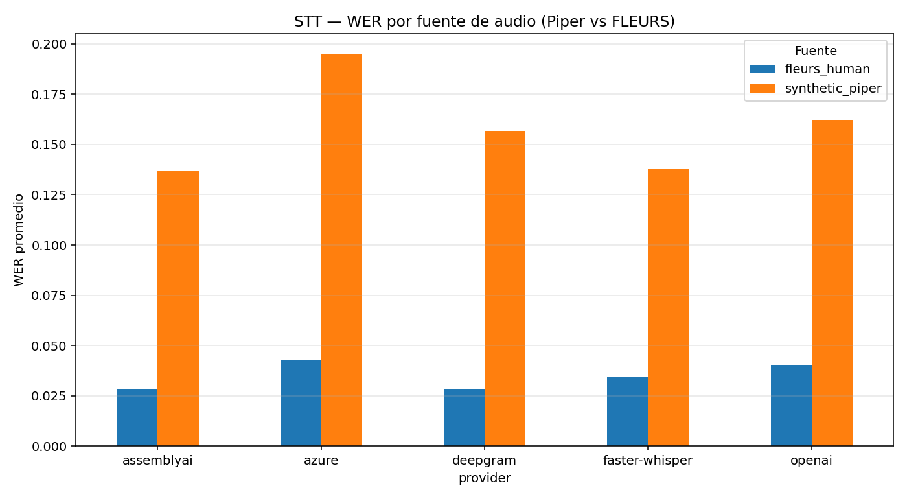
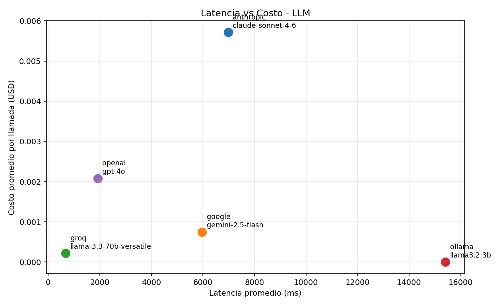
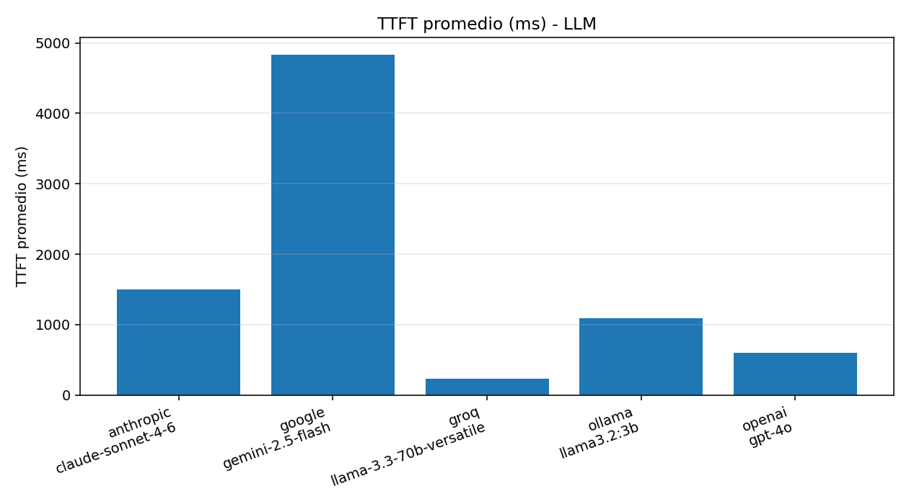
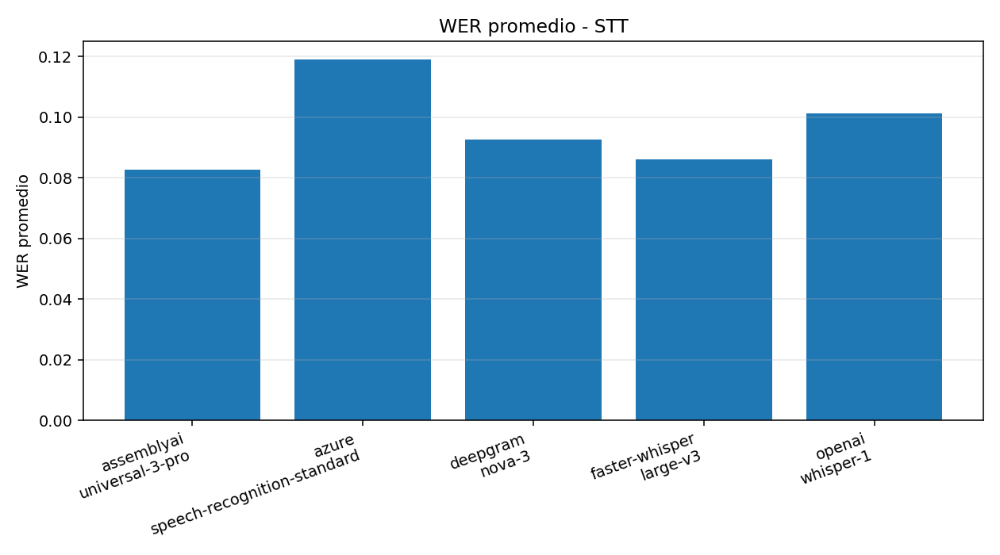
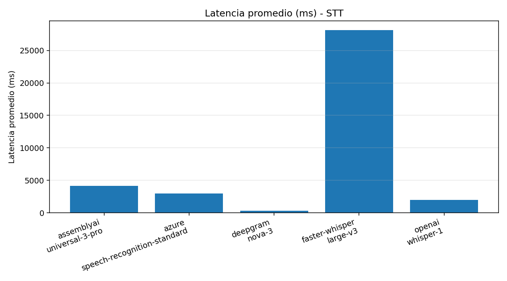
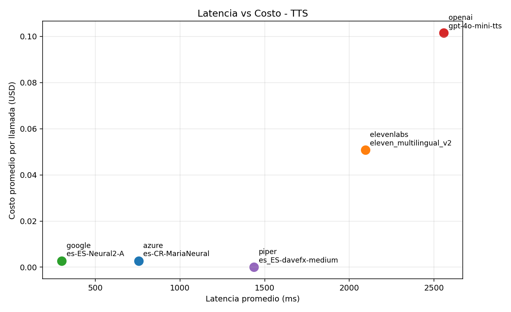
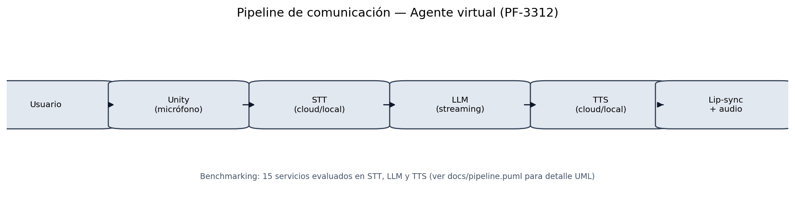

# Reporte Técnico de Benchmarking — PF-3312, Proyecto 2

**Autor:** Ney Fred Jiménez Campos  
**Carné:** B03230  
**Curso:** PF-3312 Laboratorio de Agentes Virtuales Inteligentes  
**Profesor:** Dr. Alexander Barquero  
**Programa:** Posgrado en Computación e Informática, Universidad de Costa Rica — I Ciclo 2026  
**Entregable:** Proyecto 2 · Benchmarking de Servicios de IA  
**Repositorio Unity (Proyecto 1):** [pf3312_lab](https://github.com/jmnzcn/pf3312_lab)

> Regenerar tras cada corrida: `python scripts/run_analysis.py`  
> Exportar PDF: `python scripts/export_pdf.py`

---

## 1. Introducción y Objetivos

Este proyecto mide de forma reproducible **quince servicios cognitivos** (cinco LLM,
cinco STT y cinco TTS) que alimentan el pipeline conversacional del agente virtual
desarrollado en el Proyecto 1 (captura de voz → transcripción → razonamiento →
síntesis → lip-sync en Unity).

**Objetivo general.** Evaluar empíricamente esos servicios bajo **seis dimensiones**
técnicas para fundamentar decisiones de arquitectura (nube vs. local, costo vs.
calidad, latencia vs. privacidad).

**Objetivos específicos.**

1. Medir latencia, precisión/calidad, costo, privacidad, customización e integración.
2. Contrastar opciones de alta gama en nube, bajo costo/alta velocidad y despliegue local.
3. Proponer combinaciones por escenario (tiempo real, privacidad offline, premium).

---

## 2. Metodología de Pruebas

### 2.1 Entorno

- **Hardware:** laptop Windows, NVIDIA Quadro P2000 (4 GB VRAM), 32 GB RAM, Intel i9-8950HK.
- **Red:** residencial ~200 Mbps simétricos.
- **Software:** Python 3.13, entorno virtual, repositorio `lab_entregable_2`.
- **Trazabilidad:** `results/run_manifest.json` + `run_batch_id` en cada fila CSV.

### 2.2 Inputs controlados

- **LLM:** cinco prompts en español (`common/prompts.py`).
- **STT:** diez audios: cinco sintéticos Piper (`a1_saludo_corto`–`a5_acentos_cr`) y cinco
  de voz humana **Google FLEURS** `es_419` (`g1_fleurs`–`g5_fleurs`, CC BY 4.0).
- **TTS:** cinco textos (`t1`–`t5` en `common/audio_samples.py`).

### 2.3 Protocolo

- Cinco ejecuciones por input por servicio (`python -m run_all 5`).
- Latencia con `time.perf_counter()`; **TTFT** en LLM con streaming.
- **Costo** estimado según tarifas en cada script; locales documentados con VRAM/RAM.
- **STT:** WER (`jiwer`) frente a transcripción de referencia; desglose Piper vs FLEURS.
- **TTS:** MOS inteligibilidad (WER round-trip STT→TTS) y naturalidad (escucha + estimación).
- **Dimensiones 4–6:** catálogo 1–5 en `analysis/dimensions_catalog.py`.

### 2.4 Herramientas

- SDKs cloud: OpenAI, Anthropic (`claude-sonnet-4-6`), Google Gemini/Cloud TTS, Groq,
  Deepgram, AssemblyAI, Azure Speech, ElevenLabs.
- Locales: Ollama (Llama 3.2 3B), faster-whisper (large-v3), Piper TTS.
- Análisis: `python scripts/run_analysis.py` (tablas, gráficos, dimensiones, informe).

### 2.5 Recursos locales (dimensión 3 — escalabilidad)

- **Plataforma:** Windows-11-10.0.26200-SP0
- **CPU lógicos:** 12
- **RAM total:** 31.73 GB (disponible al capturar: 9.0 GB)

| GPU | VRAM total (MB) | VRAM usada (MB) | Driver |
|-----|-----------------|-----------------|--------|
| Quadro P2000 | 4096 | 865 | 573.96 |

**Energía (estimada):** TDP referencia GPU ~75 W (Quadro P2000). En inferencia local sostenida (faster-whisper/Ollama) el consumo del sistema se acerca a carga GPU+CPU; no se midió wattímetro en esta corrida — valor indicativo para comparar nube ($/llamada) vs. estación de trabajo.

## Modelos locales evaluados

| componente     | modelo                |
|----------------|-----------------------|
| ollama         | llama3.2:3b           |
| faster_whisper | large-v3 int8_float16 |
| piper          | es_ES-davefx-medium   |

*Costo API de modelos locales: $0. Trade-off: latencia mayor y consumo de VRAM/RAM en esta estación de trabajo.*

---

## 3. Análisis por las seis dimensiones

| # | Dimensión | Medición |
|---|-----------|----------|
| 1 | Latencia | CSV: latencia, TTFT (LLM), desv. estándar |
| 2 | Precisión | WER (STT); coherencia LLM; MOS TTS |
| 3 | Costo | USD/llamada; costo por turno pipeline |
| 4 | Privacidad | Catálogo 1–5 |
| 5 | Customización | Catálogo 1–5 |
| 6 | Integración | Catálogo 1–5 |

### 3.0 Resumen transversal

*Corrida: `2026-06-08T05:47:46Z` · runs/input: 5 · Python 3.13.13*
## Cobertura de dimensiones en este repo

| Dimensión | Fuente en el proyecto |
|-----------|------------------------|
| 1 Latencia | `results/*_results.csv` (automático) |
| 2 Precisión | WER en STT (automático); LLM/TTS cualitativo |
| 3 Costo | CSV (estimado por rates en cada script) |
| 4 Privacidad | `analysis/dimensions_catalog.py` (1-5, revisar políticas) |
| 5 Customización | catálogo 1-5 |
| 6 Integración | catálogo 1-5 |

## Servicios con datos de benchmark
- **LLM**: 5 filas en matriz; CSV=sí
- **STT**: 5 filas en matriz; CSV=sí
- **TTS**: 5 filas en matriz; CSV=sí

## Mejores por dimensión (solo filas con datos)

- Menor latencia: **tts/google** (301.4 ms)
- Menor WER (STT): **stt/assemblyai** (0.0825)
- Menor costo/llamada: **llm/ollama** ($0.0)
- Mayor Privacidad (catálogo): **llm/ollama** (5/5)
- Mayor Customización (catálogo): **llm/anthropic** (5/5)
- Mayor Integración (catálogo): **llm/anthropic** (5/5)

### 3.0.1 Matriz maestra 15×6

| servicio           |   latencia_ms |   ttft_ms |      wer |   costo_usd |   privacidad_1_5 |   customizacion_1_5 |   integracion_1_5 | precision_resumen                   |
|--------------------|---------------|-----------|----------|-------------|------------------|---------------------|-------------------|-------------------------------------|
| llm/anthropic      |     6979.3000 | 1497.1000 | nan      |      0.0057 |                4 |                   5 |                 5 | Coherencia (cualitativo en informe) |
| llm/google         |     5966.0000 | 4834.1000 | nan      |      0.0007 |                3 |                   4 |                 4 | Coherencia (cualitativo en informe) |
| llm/groq           |      675.2000 |  230.7000 | nan      |      0.0002 |                4 |                   3 |                 4 | Coherencia (cualitativo en informe) |
| llm/ollama         |    15400.6000 | 1087.1000 | nan      |      0.0000 |                5 |                   4 |                 3 | Coherencia (cualitativo en informe) |
| llm/openai         |     1918.4000 |  601.1000 | nan      |      0.0021 |                3 |                   5 |                 5 | Coherencia (cualitativo en informe) |
| stt/assemblyai     |     4135.7000 |  nan      |   0.0825 |      0.0006 |                3 |                   4 |                 4 | WER=0.0825                          |
| stt/azure          |     3003.1000 |  nan      |   0.1190 |      0.0026 |                3 |                   4 |                 4 | WER=0.119                           |
| stt/deepgram       |      307.3000 |  nan      |   0.0926 |      0.0007 |                3 |                   4 |                 4 | WER=0.0926                          |
| stt/faster-whisper |    28126.8000 |  nan      |   0.0861 |      0.0000 |                5 |                   3 |                 3 | WER=0.0861                          |
| stt/openai         |     1970.8000 |  nan      |   0.1013 |      0.0009 |                3 |                   3 |                 5 | WER=0.1013                          |
| tts/azure          |      755.0000 |  nan      | nan      |      0.0027 |                3 |                   4 |                 4 | MOS 1-5 (escucha tts_outputs/)      |
| tts/elevenlabs     |     2094.4000 |  nan      | nan      |      0.0508 |                3 |                   5 |                 4 | MOS 1-5 (escucha tts_outputs/)      |
| tts/google         |      301.4000 |  nan      | nan      |      0.0027 |                3 |                   4 |                 4 | MOS 1-5 (escucha tts_outputs/)      |
| tts/openai         |     2557.2000 |  nan      | nan      |      0.1015 |                3 |                   4 |                 5 | MOS 1-5 (escucha tts_outputs/)      |
| tts/piper          |     1436.3000 |  nan      | nan      |      0.0000 |                5 |                   2 |                 2 | MOS 1-5 (escucha tts_outputs/)      |

### 3.0.2 Matrices 5×6 por categoría

| proveedor   |   latencia_ms |   ttft_ms |   wer |   costo_usd |   privacidad_1_5 |   customizacion_1_5 |   integracion_1_5 | precision_resumen                   |
|-------------|---------------|-----------|-------|-------------|------------------|---------------------|-------------------|-------------------------------------|
| anthropic   |     6979.3000 | 1497.1000 |   nan |      0.0057 |                4 |                   5 |                 5 | Coherencia (cualitativo en informe) |
| google      |     5966.0000 | 4834.1000 |   nan |      0.0007 |                3 |                   4 |                 4 | Coherencia (cualitativo en informe) |
| groq        |      675.2000 |  230.7000 |   nan |      0.0002 |                4 |                   3 |                 4 | Coherencia (cualitativo en informe) |
| ollama      |    15400.6000 | 1087.1000 |   nan |      0.0000 |                5 |                   4 |                 3 | Coherencia (cualitativo en informe) |
| openai      |     1918.4000 |  601.1000 |   nan |      0.0021 |                3 |                   5 |                 5 | Coherencia (cualitativo en informe) |

| proveedor      |   latencia_ms |   ttft_ms |    wer |   costo_usd |   privacidad_1_5 |   customizacion_1_5 |   integracion_1_5 | precision_resumen   |
|----------------|---------------|-----------|--------|-------------|------------------|---------------------|-------------------|---------------------|
| assemblyai     |     4135.7000 |       nan | 0.0825 |      0.0006 |                3 |                   4 |                 4 | WER=0.0825          |
| azure          |     3003.1000 |       nan | 0.1190 |      0.0026 |                3 |                   4 |                 4 | WER=0.119           |
| deepgram       |      307.3000 |       nan | 0.0926 |      0.0007 |                3 |                   4 |                 4 | WER=0.0926          |
| faster-whisper |    28126.8000 |       nan | 0.0861 |      0.0000 |                5 |                   3 |                 3 | WER=0.0861          |
| openai         |     1970.8000 |       nan | 0.1013 |      0.0009 |                3 |                   3 |                 5 | WER=0.1013          |

| proveedor   |   latencia_ms |   ttft_ms |   wer |   costo_usd |   privacidad_1_5 |   customizacion_1_5 |   integracion_1_5 | precision_resumen              |
|-------------|---------------|-----------|-------|-------------|------------------|---------------------|-------------------|--------------------------------|
| azure       |      755.0000 |       nan |   nan |      0.0027 |                3 |                   4 |                 4 | MOS 1-5 (escucha tts_outputs/) |
| elevenlabs  |     2094.4000 |       nan |   nan |      0.0508 |                3 |                   5 |                 4 | MOS 1-5 (escucha tts_outputs/) |
| google      |      301.4000 |       nan |   nan |      0.0027 |                3 |                   4 |                 4 | MOS 1-5 (escucha tts_outputs/) |
| openai      |     2557.2000 |       nan |   nan |      0.1015 |                3 |                   4 |                 5 | MOS 1-5 (escucha tts_outputs/) |
| piper       |     1436.3000 |       nan |   nan |      0.0000 |                5 |                   2 |                 2 | MOS 1-5 (escucha tts_outputs/) |

### 3.0.3 STT — WER por fuente de audio

| provider       | audio_source    |   wer_prom |   llamadas |
|----------------|-----------------|------------|------------|
| assemblyai     | fleurs_human    |     0.0283 |         25 |
| assemblyai     | synthetic_piper |     0.1368 |         25 |
| azure          | fleurs_human    |     0.0427 |         25 |
| azure          | synthetic_piper |     0.1952 |         25 |
| deepgram       | fleurs_human    |     0.0283 |         25 |
| deepgram       | synthetic_piper |     0.1568 |         25 |
| faster-whisper | fleurs_human    |     0.0344 |         25 |
| faster-whisper | synthetic_piper |     0.1378 |         25 |
| openai         | fleurs_human    |     0.0405 |         25 |
| openai         | synthetic_piper |     0.1621 |         25 |

### 3.0.4 Calidad LLM

*Corrida: `2026-06-08T05:47:46Z` · runs/input: 5 · Python 3.13.13*

## Prompt p3_json_estricto — cumplimiento de esquema JSON

| provider   |   llamadas |   json_valido |   tasa_json |
|------------|------------|---------------|-------------|
| anthropic  |          5 |             5 |         1   |
| google     |          5 |             5 |         1   |
| groq       |          5 |             5 |         1   |
| ollama     |          5 |             2 |         0.4 |
| openai     |          5 |             3 |         0.6 |

*Coherencia global en p1/p2/p4/p5: `data/llm_quality_notes.json`.*

## Notas cualitativas (archivo)

| provider   |   coherencia_1_5 |   instrucciones_1_5 | nota                                                                                                                                                                                         |
|------------|------------------|---------------------|----------------------------------------------------------------------------------------------------------------------------------------------------------------------------------------------|
| openai     |                5 |                   4 | Respuestas claras en español; p2 razona por combinaciones; p3 JSON con clave agentes; p4 resume las 6 dimensiones; p5 cumple rol Max con calentamiento. Población AMCR varía entre corridas. |
| anthropic  |                5 |                   3 | Contenido sólido pero añade markdown/emojis en p1–p5 cuando se pidió texto plano o JSON exclusivo; p3 sí entrega JSON válido. Excelente estructura en p2.                                    |
| google     |                4 |                   4 | Buen español y resúmenes útiles; p3 JSON 100% válido en corrida 2026-06-08; p4 condensa bien el texto largo.                                                                                |
| groq       |                4 |                   3 | Rápido y coherente; p4 muy breve (cubre 3 bloques pero poco detalle); p3 a veces devuelve array sin envoltorio agentes; p5 ofrece rutina de calentamiento.                                   |
| ollama     |                3 |                   3 | Llama 3.2 3B local: p1 excede una oración; p3 JSON válido pero con personajes fuera de contexto (Batman/Sonic); p2 y p4 razonables para tamaño del modelo.                                   |

### 3.0.5 MOS TTS

| provider   |   mos_inteligibilidad |   mos_naturalidad |   wer_promedio | nota                                                                      |
|------------|-----------------------|-------------------|----------------|---------------------------------------------------------------------------|
| azure      |                     4 |                 4 |         0.08   | Voz es-CR clara; t1 con WER alto por saludo informal transcrito distinto. |
| elevenlabs |                     4 |                 5 |         0.0741 | Mejor naturalidad esperada; WER casi cero en t2/t3.                       |
| google     |                     3 |                 4 |         0.1211 | Ligera pérdida en t2; neural estable en párrafo largo.                    |
| openai     |                     4 |                 4 |         0.0921 | Buena inteligibilidad en textos medios/largos.                            |
| piper      |                     4 |                 3 |         0.0902 | Local gratuito; timbre más sintético que nube.                            |

### 3.0.6 Costo por turno conversacional

*Promedio de costo/latencia por llamada en la última corrida filtrada.*

| escenario          | llm    | stt            | tts        |   costo_usd_turno |   latencia_ms_turno |
|--------------------|--------|----------------|------------|-------------------|---------------------|
| Demo rápida nube   | groq   | deepgram       | google     |          0.0036   |              1283.9 |
| Calidad premium    | openai | assemblyai     | elevenlabs |          0.053406 |              8148.5 |
| Privacidad offline | ollama | faster-whisper | piper      |          0        |             44963.6 |
| Stack Azure        | openai | azure          | azure      |          0.00741  |              5676.5 |

---

### 3.1 LLM

*Corrida: `2026-06-08T05:47:46Z` · runs/input: 5 · Python 3.13.13*

| provider   | model                   | deployment   |   llamadas |   latencia_ms_prom |   latencia_ms_std |   latencia_ms_p95 |   ttft_ms_prom |   costo_usd_prom | categoria   |
|------------|-------------------------|--------------|------------|--------------------|-------------------|-------------------|----------------|------------------|-------------|
| anthropic  | claude-sonnet-4-6       | cloud        |         25 |            6979.31 |           4672.96 |          14756.4  |        1497.13 |         0.005716 | llm         |
| google     | gemini-2.5-flash        | cloud        |         25 |            5966.03 |           4251.84 |          12148.9  |        4834.07 |         0.000748 | llm         |
| groq       | llama-3.3-70b-versatile | cloud        |         25 |             675.16 |            380.8  |           1399.7  |         230.73 |         0.000218 | llm         |
| ollama     | llama3.2:3b             | local        |         25 |           15400.6  |          12408.9  |          37157    |        1087.1  |         0        | llm         |
| openai     | gpt-4o                  | cloud        |         25 |            1918.41 |           1440.69 |           4816.11 |         601.13 |         0.002081 | llm         |

**Hallazgos.** Groq lidera latencia y costo; OpenAI equilibra velocidad y calidad;
Anthropic (`claude-sonnet-4-6`) aporta flexibilidad a mayor costo; Gemini con TTFT
elevado; Ollama local sin costo API pero latencia alta. Ver §3.0.4 para JSON p3 y
notas cualitativas.

---

### 3.2 STT

*Corrida: `2026-06-08T05:47:46Z` · runs/input: 5 · Python 3.13.13*

| provider       | model                       | deployment   |   llamadas |   latencia_ms_prom |   latencia_ms_std |   latencia_ms_p95 |   costo_usd_prom |   calidad_prom | categoria   |
|----------------|-----------------------------|--------------|------------|--------------------|-------------------|-------------------|------------------|----------------|-------------|
| assemblyai     | universal-3-pro             | cloud        |         50 |            4135.69 |            834.45 |           6669.46 |         0.000565 |           0.08 | stt         |
| azure          | speech-recognition-standard | cloud        |         50 |            3003.11 |           1666.2  |           5829.81 |         0.002622 |           0.12 | stt         |
| deepgram       | nova-3                      | cloud        |         50 |             307.33 |            182.28 |            691.94 |         0.000675 |           0.09 | stt         |
| faster-whisper | large-v3                    | local        |         50 |           28126.8  |           5684.84 |          37294.8  |         0        |           0.09 | stt         |
| openai         | whisper-1                   | cloud        |         50 |            1970.79 |            715.71 |           3319.25 |         0.000942 |           0.1  | stt         |

**Hallazgos.** Deepgram es el más rápido en nube; WER mejora con voz FLEURS (~0.03)
frente a Piper sintético (~0.14–0.19). faster-whisper local alcanza WER competitivo
sin costo API a cambio de latencia muy alta. Detalle por fuente en §3.0.3.

---

### 3.3 TTS

*Corrida: `2026-06-08T05:47:46Z` · runs/input: 5 · Python 3.13.13*

| provider   | model                  | deployment   |   llamadas |   latencia_ms_prom |   latencia_ms_std |   latencia_ms_p95 |   costo_usd_prom | categoria   |
|------------|------------------------|--------------|------------|--------------------|-------------------|-------------------|------------------|-------------|
| azure      | es-CR-MariaNeural      | cloud        |         25 |             754.99 |            245.7  |            927.32 |         0.002707 | tts         |
| elevenlabs | eleven_multilingual_v2 | cloud        |         25 |            2094.38 |           1319.89 |           4671.55 |         0.05076  | tts         |
| google     | es-ES-Neural2-A        | cloud        |         25 |             301.38 |            201.68 |            717.94 |         0.002707 | tts         |
| openai     | gpt-4o-mini-tts        | cloud        |         25 |            2557.19 |           1041.41 |           4455.28 |         0.10152  | tts         |
| piper      | es_ES-davefx-medium    | local        |         25 |            1436.26 |            683.72 |           2754.97 |         0        | tts         |

**Hallazgos.** Google TTS lidera latencia con costo bajo; Piper gratuito local;
ElevenLabs/OpenAI TTS más costosos. MOS en §3.0.5.

---

## 4. Arquitectura y Pipeline de Comunicación

Diagrama UML detallado: `docs/pipeline.puml`.

**Flujo:** micrófono Unity → STT → LLM (streaming) → TTS → reproducción + lip-sync.

---

## 5. Recomendaciones y Conclusión

Con **15/15 servicios** medidos en la corrida filtrada (`run_batch_id` en manifiesto):

| Escenario | Pipeline | Por qué |
|-----------|----------|---------|
| Demo rápida nube | Groq + Deepgram + Google TTS | Latencia y costo bajos (§3.0.6) |
| Calidad premium | OpenAI/Anthropic + AssemblyAI + ElevenLabs | WER/STT y voz premium |
| Privacidad offline | Ollama + faster-whisper + Piper | Sin terceros; VRAM/RAM en §2.5 |
| Stack Azure | Azure STT + TTS (`es-CR`) | Una key, integración .NET |

**Conclusión.** No hay ganador único: la elección depende del caso de uso del agente
(Proyecto 1). Los datos empíricos de esta corrida sustentan las combinaciones anteriores.

---

## 6. Referencias

- OpenAI API Pricing. <https://openai.com/api/pricing/>
- Anthropic Claude pricing. <https://www.anthropic.com/pricing>
- Google AI Gemini pricing. <https://ai.google.dev/pricing>
- Google FLEURS dataset. <https://huggingface.co/datasets/google/fleurs>
- Groq pricing. <https://groq.com/pricing>
- Deepgram, AssemblyAI, Azure Speech, Google Cloud TTS (precios oficiales).
- Ollama, faster-whisper, Piper TTS (documentación open source).

---

## Apéndice A — Archivos generados

| Carpeta | Contenido |
|---------|-----------|
| `docs/tablas_generadas/` | Resumen LLM, STT, TTS, costo pipeline |
| `docs/graficos_generados/` | Latencia, costo, heatmaps, pipeline PNG |
| `docs/dimensiones_generadas/` | Seis dimensiones + matrices |
| `results/` | CSV, raw JSON, manifiesto, hardware |
